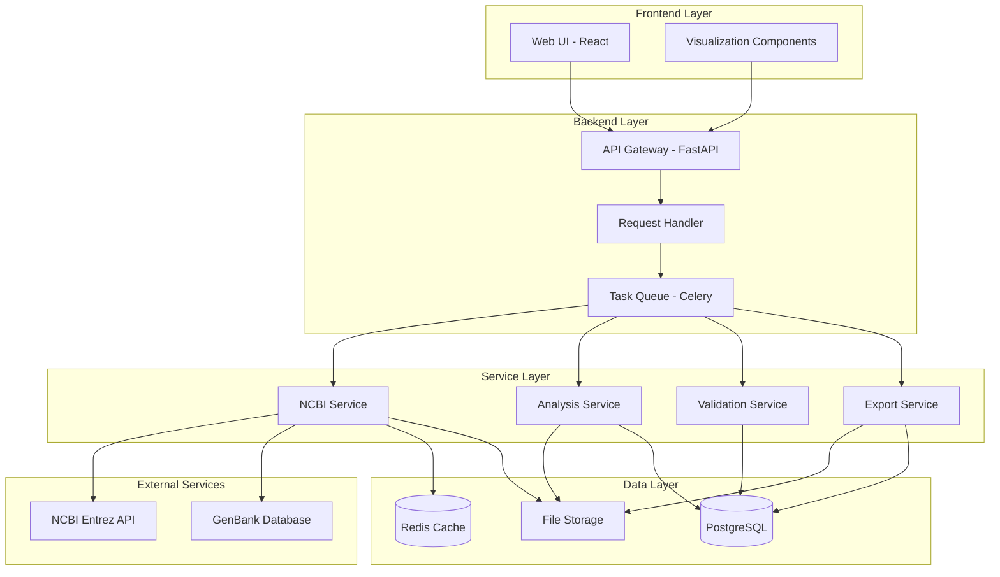
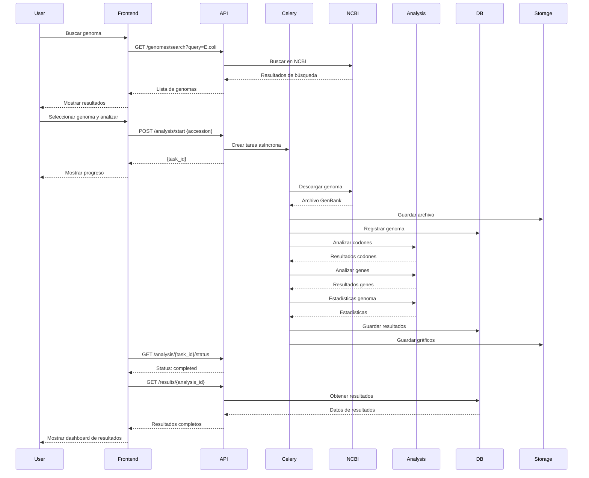
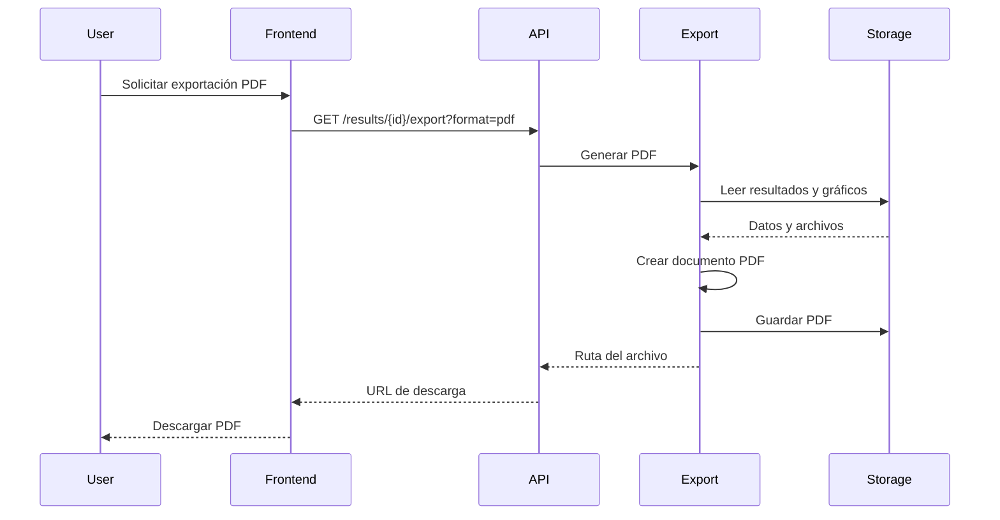
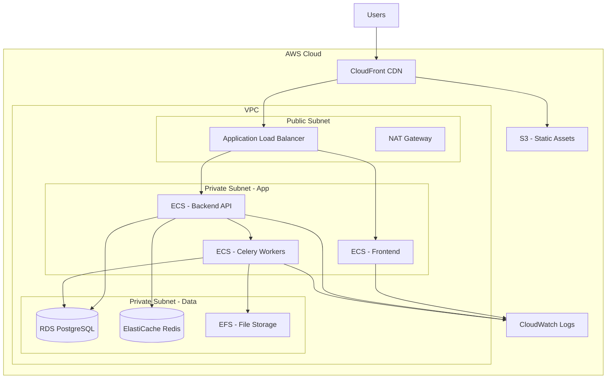

# Arquitectura del Sistema - Plataforma de Análisis Genómico

## 1. Visión General de la Arquitectura

### 1.1 Tipo de Arquitectura
**Arquitectura de 3 Capas con Microservicios**



### 1.2 Principios de Diseño
- **Separación de Responsabilidades:** Frontend, Backend, y Servicios claramente separados
- **Escalabilidad Horizontal:** Servicios independientes que pueden escalar según demanda
- **Procesamiento Asíncrono:** Análisis largos ejecutados en background con cola de tareas
- **Caché Inteligente:** Genomas frecuentes almacenados para reducir llamadas a NCBI
- **API-First:** Backend expone API RESTful bien documentada
- **Stateless:** Servicios sin estado para facilitar escalamiento

---

## 2. Componentes del Sistema

### 2.1 Frontend (React + TypeScript)

#### Responsabilidades
- Interfaz de usuario interactiva
- Visualización de datos y gráficos
- Gestión de estado de aplicación
- Comunicación con API backend

#### Tecnologías
- **Framework:** React 18+ con TypeScript
- **Estado:** Redux Toolkit o Zustand
- **Routing:** React Router v6
- **UI Components:** Material-UI (MUI) o Chakra UI
- **Gráficos:** Plotly.js o Recharts
- **HTTP Client:** Axios
- **Build Tool:** Vite

#### Estructura de Componentes
```
frontend/
├── src/
│   ├── components/
│   │   ├── search/
│   │   │   ├── GenomeSearch.tsx
│   │   │   ├── SearchResults.tsx
│   │   │   └── SearchFilters.tsx
│   │   ├── analysis/
│   │   │   ├── AnalysisPanel.tsx
│   │   │   ├── ProgressIndicator.tsx
│   │   │   └── AnalysisControls.tsx
│   │   ├── results/
│   │   │   ├── ResultsDashboard.tsx
│   │   │   ├── CodonAnalysis.tsx
│   │   │   ├── GeneStatistics.tsx
│   │   │   └── ValidationPanel.tsx
│   │   ├── visualization/
│   │   │   ├── CodonChart.tsx
│   │   │   ├── GeneLengthHistogram.tsx
│   │   │   ├── GCContentPlot.tsx
│   │   │   └── GenomeMap.tsx
│   │   └── common/
│   │       ├── Header.tsx
│   │       ├── Footer.tsx
│   │       ├── LoadingSpinner.tsx
│   │       └── ErrorBoundary.tsx
│   ├── pages/
│   │   ├── HomePage.tsx
│   │   ├── SearchPage.tsx
│   │   ├── AnalysisPage.tsx
│   │   └── ResultsPage.tsx
│   ├── services/
│   │   ├── api.ts
│   │   ├── genomeService.ts
│   │   └── analysisService.ts
│   ├── store/
│   │   ├── slices/
│   │   │   ├── genomeSlice.ts
│   │   │   ├── analysisSlice.ts
│   │   │   └── uiSlice.ts
│   │   └── store.ts
│   ├── types/
│   │   ├── genome.types.ts
│   │   ├── analysis.types.ts
│   │   └── api.types.ts
│   ├── utils/
│   │   ├── formatters.ts
│   │   ├── validators.ts
│   │   └── constants.ts
│   └── App.tsx
```

---

### 2.2 Backend API (FastAPI + Python)

#### Responsabilidades
- Exponer API RESTful
- Validación de requests
- Autenticación y rate limiting
- Orquestación de servicios
- Gestión de tareas asíncronas

#### Tecnologías
- **Framework:** FastAPI 0.100+
- **ASGI Server:** Uvicorn
- **Task Queue:** Celery con Redis
- **Validación:** Pydantic v2
- **ORM:** SQLAlchemy 2.0
- **Migrations:** Alembic

#### Endpoints Principales

```python
# Búsqueda de genomas
GET  /api/v1/genomes/search?query={query}&limit={limit}
GET  /api/v1/genomes/{accession}

# Descarga y análisis
POST /api/v1/analysis/start
GET  /api/v1/analysis/{task_id}/status
GET  /api/v1/analysis/{task_id}/results

# Resultados
GET  /api/v1/results/{analysis_id}
GET  /api/v1/results/{analysis_id}/export?format={json|csv|pdf}

# Validación
GET  /api/v1/validation/references
POST /api/v1/validation/compare

# Salud del sistema
GET  /api/v1/health
GET  /api/v1/metrics
```

#### Estructura Backend
```
backend/
├── app/
│   ├── api/
│   │   ├── v1/
│   │   │   ├── endpoints/
│   │   │   │   ├── genomes.py
│   │   │   │   ├── analysis.py
│   │   │   │   ├── results.py
│   │   │   │   └── validation.py
│   │   │   └── router.py
│   │   └── dependencies.py
│   ├── core/
│   │   ├── config.py
│   │   ├── security.py
│   │   └── logging.py
│   ├── models/
│   │   ├── genome.py
│   │   ├── analysis.py
│   │   └── result.py
│   ├── schemas/
│   │   ├── genome.py
│   │   ├── analysis.py
│   │   └── result.py
│   ├── services/
│   │   ├── ncbi_service.py
│   │   ├── analysis_service.py
│   │   ├── validation_service.py
│   │   └── export_service.py
│   ├── tasks/
│   │   ├── celery_app.py
│   │   ├── analysis_tasks.py
│   │   └── download_tasks.py
│   ├── db/
│   │   ├── session.py
│   │   └── base.py
│   └── main.py
```

---

### 2.3 Servicios de Análisis (Python + BioPython)

#### NCBI Service
**Responsabilidad:** Interacción con NCBI APIs

```python
# Funcionalidades principales
- search_genomes(query, filters)
- download_genome(accession)
- validate_genome_integrity(file_path)
- get_genome_metadata(accession)
- cache_genome(accession, data)
```

**Tecnologías:**
- BioPython Entrez
- Requests con retry logic
- Redis para caché

---

#### Analysis Service
**Responsabilidad:** Ejecución de análisis bioinformáticos

```python
# Módulos de análisis
- CodonAnalyzer
  - count_start_codons(sequence)
  - count_stop_codons(sequence)
  - calculate_codon_density(sequence)
  
- GeneAnalyzer
  - extract_genes(genbank_record)
  - calculate_gene_statistics(genes)
  - analyze_gc_content(genes)
  
- GenomeAnalyzer
  - calculate_genome_stats(record)
  - analyze_genome_composition(sequence)
  - generate_genome_summary(record)
```

**Tecnologías:**
- BioPython (SeqIO, SeqUtils)
- NumPy para cálculos numéricos
- Pandas para manipulación de datos

---

#### Validation Service
**Responsabilidad:** Validación de resultados contra referencias

```python
# Funcionalidades
- load_reference_data()
- compare_with_reference(results, reference)
- calculate_deviations(observed, expected)
- generate_validation_report(comparison)
```

**Base de datos de referencia:**
```json
{
  "NC_000913.3": {
    "organism": "Escherichia coli K-12 MG1655",
    "genome_size": 4641652,
    "gc_content": 50.8,
    "gene_count": 4321,
    "avg_gene_length": 948,
    "stop_codon_freq": {
      "TAA": 0.61,
      "TAG": 0.09,
      "TGA": 0.30
    }
  }
}
```

---

#### Export Service
**Responsabilidad:** Generación de reportes y exportaciones

```python
# Formatos de exportación
- export_to_json(results)
- export_to_csv(results)
- export_to_pdf(results, charts)
- generate_charts(data)
```

**Tecnologías:**
- Matplotlib/Plotly para gráficos
- ReportLab para PDFs
- Pandas para CSV

---

### 2.4 Capa de Datos

#### PostgreSQL Database
**Esquema de Base de Datos:**

```sql
-- Tabla de genomas descargados
CREATE TABLE genomes (
    id SERIAL PRIMARY KEY,
    accession VARCHAR(50) UNIQUE NOT NULL,
    organism_name VARCHAR(255) NOT NULL,
    genome_size INTEGER,
    gc_content DECIMAL(5,2),
    download_date TIMESTAMP DEFAULT CURRENT_TIMESTAMP,
    file_path VARCHAR(500),
    metadata JSONB
);

-- Tabla de análisis ejecutados
CREATE TABLE analyses (
    id SERIAL PRIMARY KEY,
    genome_id INTEGER REFERENCES genomes(id),
    task_id VARCHAR(100) UNIQUE,
    status VARCHAR(50), -- pending, running, completed, failed
    started_at TIMESTAMP DEFAULT CURRENT_TIMESTAMP,
    completed_at TIMESTAMP,
    error_message TEXT
);

-- Tabla de resultados
CREATE TABLE results (
    id SERIAL PRIMARY KEY,
    analysis_id INTEGER REFERENCES analyses(id),
    result_type VARCHAR(50), -- codon_analysis, gene_stats, etc.
    data JSONB NOT NULL,
    created_at TIMESTAMP DEFAULT CURRENT_TIMESTAMP
);

-- Tabla de validaciones
CREATE TABLE validations (
    id SERIAL PRIMARY KEY,
    analysis_id INTEGER REFERENCES analyses(id),
    reference_accession VARCHAR(50),
    deviations JSONB,
    validation_status VARCHAR(20), -- passed, warning, failed
    created_at TIMESTAMP DEFAULT CURRENT_TIMESTAMP
);

-- Índices para optimización
CREATE INDEX idx_genomes_accession ON genomes(accession);
CREATE INDEX idx_analyses_task_id ON analyses(task_id);
CREATE INDEX idx_analyses_status ON analyses(status);
CREATE INDEX idx_results_analysis_id ON results(analysis_id);
```

#### Redis Cache
**Uso:**
- Caché de genomas frecuentemente solicitados (TTL: 7 días)
- Caché de resultados de búsqueda (TTL: 1 hora)
- Estado de tareas Celery
- Rate limiting

**Estructura de claves:**
```
genome:{accession} -> GenBank data
search:{query_hash} -> Search results
task:{task_id} -> Task status
ratelimit:{ip}:{endpoint} -> Request count
```

#### File Storage
**Estructura de directorios:**
```
data/
├── genomes/
│   ├── NC_000913.3.gb
│   ├── NC_000913.3.fasta
│   └── ...
├── results/
│   ├── {analysis_id}/
│   │   ├── summary.json
│   │   ├── codon_analysis.csv
│   │   ├── gene_stats.csv
│   │   └── charts/
│   │       ├── codon_frequency.png
│   │       ├── gene_length_dist.png
│   │       └── gc_content.png
└── exports/
    └── {analysis_id}/
        └── report.pdf
```

---

## 3. Flujo de Datos

### 3.1 Flujo de Análisis Completo



### 3.2 Flujo de Exportación



---

## 4. Tecnologías y Stack Completo

### Frontend Stack
```json
{
  "framework": "React 18.2",
  "language": "TypeScript 5.0",
  "state": "Redux Toolkit",
  "routing": "React Router 6",
  "ui": "Material-UI 5",
  "charts": "Plotly.js",
  "http": "Axios",
  "build": "Vite 4"
}
```

### Backend Stack
```json
{
  "framework": "FastAPI 0.100",
  "language": "Python 3.11",
  "server": "Uvicorn",
  "task_queue": "Celery 5.3",
  "broker": "Redis 7",
  "orm": "SQLAlchemy 2.0",
  "validation": "Pydantic 2.0",
  "bioinformatics": "BioPython 1.81"
}
```

### Data Stack
```json
{
  "database": "PostgreSQL 15",
  "cache": "Redis 7",
  "storage": "Local FileSystem / S3"
}
```

### DevOps Stack
```json
{
  "containerization": "Docker + Docker Compose",
  "ci_cd": "GitHub Actions",
  "monitoring": "Prometheus + Grafana",
  "logging": "ELK Stack (Elasticsearch, Logstash, Kibana)"
}
```

---

## 5. Seguridad

### 5.1 Medidas de Seguridad

#### Input Validation
- Validación de accession numbers (formato correcto)
- Sanitización de nombres de archivo
- Límites de tamaño de archivo (max 50 MB)
- Validación de parámetros de búsqueda

#### Rate Limiting
```python
# Límites por endpoint
/api/v1/genomes/search: 10 requests/minute
/api/v1/analysis/start: 5 requests/minute
/api/v1/results/*: 30 requests/minute
```

#### CORS Configuration
```python
ALLOWED_ORIGINS = [
    "http://localhost:3000",  # Development
    "https://genomics-platform.com"  # Production
]
```

#### Error Handling
- No exponer stack traces en producción
- Mensajes de error genéricos para usuarios
- Logging detallado en servidor

---

## 6. Escalabilidad

### 6.1 Estrategias de Escalamiento

#### Horizontal Scaling
- **Frontend:** CDN para assets estáticos
- **API:** Múltiples instancias detrás de load balancer
- **Celery Workers:** Escalar workers según carga
- **Database:** Read replicas para queries

#### Caching Strategy
```
Level 1: Browser cache (static assets)
Level 2: CDN cache (frontend bundle)
Level 3: Redis cache (API responses, genomes)
Level 4: Database query cache
```

#### Performance Optimization
- Lazy loading de componentes React
- Paginación de resultados de búsqueda
- Streaming de archivos grandes
- Compresión gzip/brotli
- Database indexing estratégico

---

## 7. Monitoreo y Logging

### 7.1 Métricas Clave

```python
# Application Metrics
- Request rate (requests/second)
- Response time (p50, p95, p99)
- Error rate (%)
- Active analyses
- Queue length (Celery)

# Business Metrics
- Genomes analyzed per day
- Most searched organisms
- Average analysis time
- Export format preferences

# Infrastructure Metrics
- CPU usage
- Memory usage
- Disk I/O
- Network throughput
- Database connections
```

### 7.2 Logging Strategy

```python
# Log Levels
DEBUG: Detailed diagnostic info
INFO: General informational messages
WARNING: Warning messages (e.g., slow queries)
ERROR: Error events
CRITICAL: Critical failures

# Log Structure (JSON)
{
  "timestamp": "2026-02-07T16:20:00Z",
  "level": "INFO",
  "service": "analysis_service",
  "task_id": "abc123",
  "accession": "NC_000913.3",
  "message": "Analysis completed successfully",
  "duration_ms": 45230
}
```

---

## 8. Deployment Architecture

### 8.1 Docker Compose (Development)

```yaml
services:
  frontend:
    build: ./frontend
    ports: ["3000:3000"]
    
  backend:
    build: ./backend
    ports: ["8000:8000"]
    depends_on: [postgres, redis]
    
  celery_worker:
    build: ./backend
    command: celery -A app.tasks worker
    depends_on: [redis, postgres]
    
  postgres:
    image: postgres:15
    volumes: ["postgres_data:/var/lib/postgresql/data"]
    
  redis:
    image: redis:7
    
  nginx:
    image: nginx:alpine
    ports: ["80:80"]
    depends_on: [frontend, backend]
```

### 8.2 AWS Deployment (Production)



---

## 9. Consideraciones Futuras

### 9.1 Mejoras Planificadas

#### Fase 2
- Análisis comparativo de múltiples genomas
- Visualización de genomas circulares
- Anotación automática de genes
- Integración con más bases de datos (UniProt, KEGG)

#### Fase 3
- Machine Learning para predicción de genes
- Análisis filogenético
- Colaboración multi-usuario
- API pública para terceros

### 9.2 Limitaciones Actuales

- Solo genomas procariotas (bacterias)
- Análisis limitado a genomas completos (no drafts)
- Sin soporte para genomas > 15 MB
- Procesamiento secuencial (no paralelo dentro de un análisis)

---

## 10. Decisiones Arquitectónicas Clave

### ¿Por qué FastAPI?
- Alto rendimiento (comparable a Node.js)
- Validación automática con Pydantic
- Documentación automática (OpenAPI)
- Soporte nativo para async/await
- Excelente para APIs científicas

### ¿Por qué Celery?
- Procesamiento asíncrono robusto
- Manejo de tareas largas (análisis genómicos)
- Retry logic incorporado
- Monitoreo con Flower
- Escalabilidad horizontal

### ¿Por qué PostgreSQL?
- Soporte JSONB para datos semi-estructurados
- Rendimiento superior para queries complejas
- Integridad referencial
- Extensiones científicas disponibles

### ¿Por qué React?
- Ecosistema maduro
- Componentes reutilizables
- Excelente para visualizaciones interactivas
- Gran comunidad y librerías

---

## Resumen Ejecutivo

Esta arquitectura proporciona:

✅ **Escalabilidad:** Componentes independientes que escalan según demanda  
✅ **Rendimiento:** Caché multi-nivel y procesamiento asíncrono  
✅ **Mantenibilidad:** Código modular y bien organizado  
✅ **Extensibilidad:** Fácil agregar nuevos análisis o integraciones  
✅ **Confiabilidad:** Manejo robusto de errores y monitoreo completo  
✅ **Usabilidad:** Interfaz moderna y responsive  

La plataforma está diseñada para soportar desde estudiantes individuales hasta uso institucional con cientos de análisis concurrentes.
